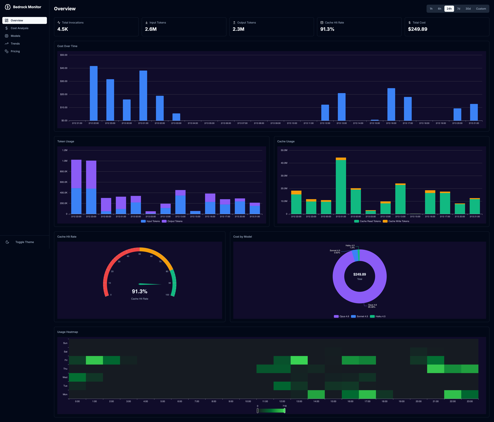
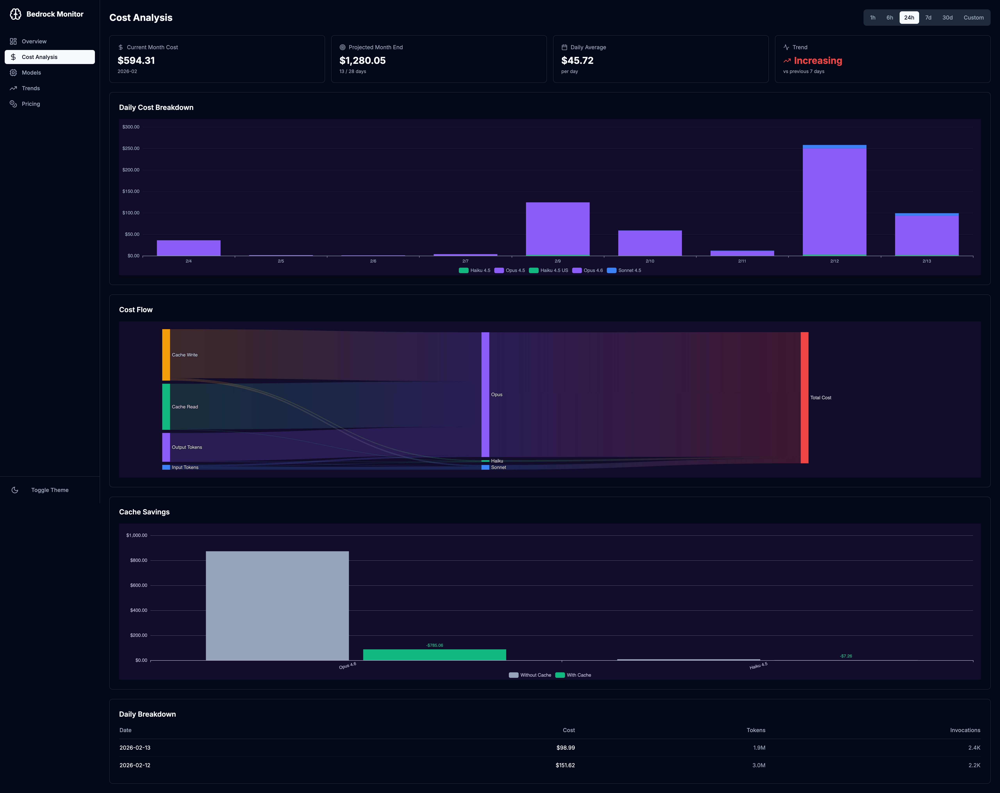
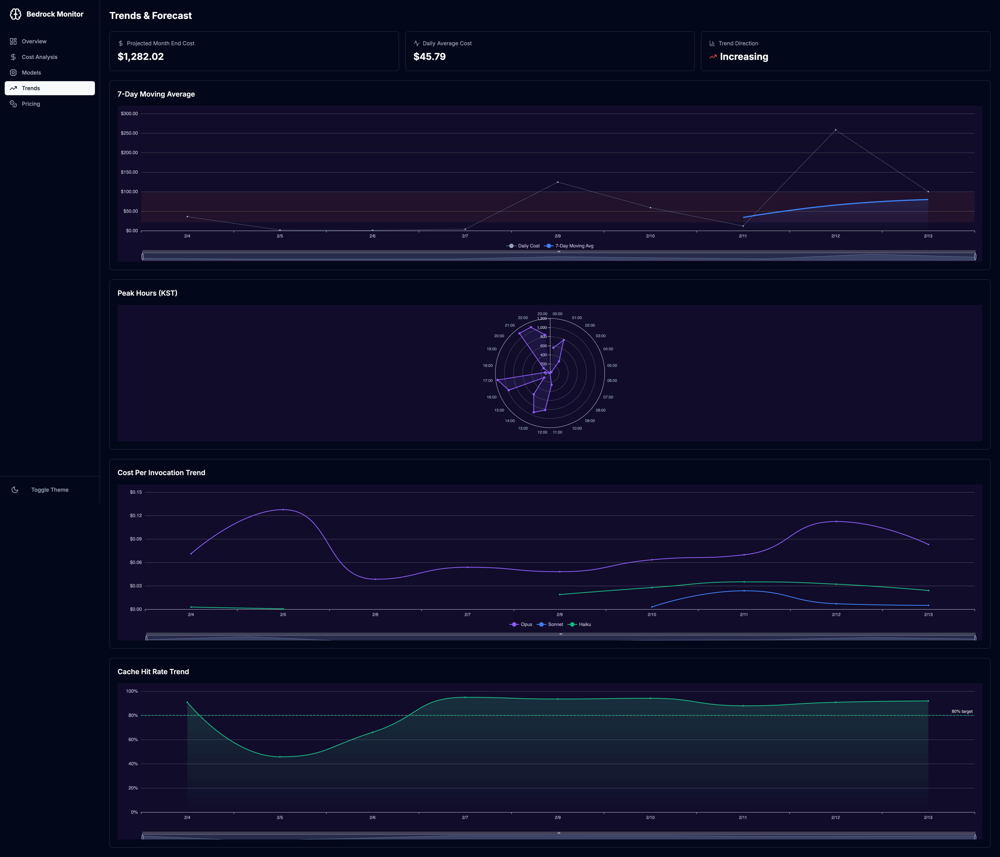

# Bedrock Claude Code Monitor

Amazon Bedrock에서 Claude 모델 사용량과 비용을 실시간으로 모니터링하는 웹 대시보드입니다.

## 개요

Claude Code와 같은 AI 코딩 도구가 Amazon Bedrock을 통해 Claude 모델을 호출할 때 발생하는 토큰 사용량, 비용, 레이턴시를 1분 단위로 자동 수집하여 시각화합니다. CloudWatch 메트릭을 기반으로 8개 Claude 모델의 사용 현황을 추적하고, 캐시 절감 분석과 월말 비용 예측 기능을 제공합니다.

## 주요 기능

- **실시간 메트릭 수집**: EventBridge + Lambda로 1분마다 CloudWatch `AWS/Bedrock` 네임스페이스의 메트릭을 자동 수집하여 DynamoDB에 4단계(분/시/일/월) 집계
- **비용 분석**: 모델별 비용 추적, 일별 비용 Stacked Bar 차트, Sankey 다이어그램을 통한 비용 흐름 시각화, 캐시 절감 비교 분석
- **월말 비용 예측**: 일평균 비용 기반 월 전체 비용 추정 및 7일 단위 트렌드 분석 (증가/안정/감소)
- **캐시 효율 분석**: 캐시 읽기/쓰기 토큰 추적, 캐시 히트율 게이지, 캐시 미사용 시 대비 절감액 계산 및 시각화, 캐시 히트율 추이 트렌드
- **모델 효율성 분석**: Input/Output 비용 비율 비교, 비용 vs 레이턴시 버블 Scatter 차트, 호출당 비용(Cost Per Invocation) 추이 분석
- **8개 Claude 모델 지원**: Opus 4.6, Opus 4.5, Sonnet 4.6, Sonnet 4.5, Haiku 4.5, Haiku 3.5 (Global/US Regional)
- **반응형 모바일 지원**: 접이식 사이드바를 포함한 반응형 레이아웃으로 모바일/태블릿 환경 지원
- **다크/라이트 테마**: next-themes 기반 테마 전환 지원
- **커스텀 시간 범위**: 1h, 6h, 24h, 7d, 30d 프리셋 및 Custom(날짜 직접 지정) 지원

## 기술 스택

| 영역 | 기술 |
|------|------|
| Frontend | Next.js 15, React 19, TypeScript, Tailwind CSS, Responsive (모바일/태블릿) |
| Charts | Apache ECharts 5.6 (echarts-for-react) |
| State Management | TanStack Query v5 (60초 자동 갱신) |
| Backend API | Next.js API Routes (App Router) |
| Data Store | Amazon DynamoDB (On-Demand, TTL, PITR) |
| Aggregator | AWS Lambda (Python 3.12) + EventBridge (1분 간격) |
| Container | Docker (Node.js 20 Alpine, standalone 빌드, ARM64) |
| CDN / Ingress | Amazon CloudFront (VPC Origin) |
| Hosting | ECS Fargate (Graviton) + Internal ALB |
| IaC | AWS CDK 2.178+ (TypeScript, 2개 스택) |

## 아키텍처

```
CloudWatch (AWS/Bedrock)
  │
  ▼
EventBridge (1분 간격) ──► Lambda Aggregator (Python 3.12)
                                    │
                           ┌────────▼────────┐
                           │    DynamoDB      │
                           │ (분/시/일/월누적) │
                           └────────┬────────┘
                                    │
  사용자 ──► CloudFront ──► Internal ALB ──► ECS Fargate (Next.js 15, ARM64)
             (HTTPS)      (VPC Origin)              │
                                              ┌─────┴─────┐
                                              │           │
                                          DynamoDB    CloudWatch
                                          (이력)      (실시간)
```

### 데이터 흐름

1. **수집**: EventBridge가 1분마다 Lambda Aggregator를 호출합니다.
2. **집계**: Lambda가 CloudWatch `AWS/Bedrock` 네임스페이스에서 8개 모델의 메트릭을 조회합니다.
3. **저장**: 비용을 계산하여 DynamoDB에 4단계 granularity로 기록합니다 (분/시/일/월누적).
4. **조회**: Next.js API Routes가 DynamoDB 이력 또는 CloudWatch 실시간 데이터를 제공합니다.
5. **시각화**: ECharts 기반 대시보드에서 60초 자동 갱신으로 표시합니다.

## 시작하기

### 사전 요구사항

- AWS CLI 설정 완료 (`aws configure`)
- Node.js 20+
- AWS CDK CLI (`npm install -g aws-cdk`)
- Docker 런타임 (Docker Desktop 또는 [colima](https://github.com/abiosoft/colima))

> **참고**: Docker Desktop 라이선스가 없는 경우 colima를 사용할 수 있습니다.
> ```bash
> brew install colima
> colima start
> export DOCKER_HOST=unix://$HOME/.colima/default/docker.sock
> ```

### 배포

CDK는 `fromAsset()` 방식으로 Docker 이미지를 자동 빌드하여 ECR에 푸시합니다. 별도의 수동 Docker 빌드가 필요 없습니다.

```bash
# 1. CDK 의존성 설치
cd cdk
npm install

# 2. CDK 부트스트랩 (최초 1회)
cdk bootstrap aws://ACCOUNT_ID/us-east-1

# 3. 전체 스택 배포 (DataPipelineStack + WebAppStack)
cdk deploy --all --require-approval never

# colima 사용 시
DOCKER_HOST=unix://$HOME/.colima/default/docker.sock cdk deploy --all --require-approval never
```

배포 완료 후 CloudFront URL이 출력됩니다:
```
Outputs:
  WebAppStack.DashboardUrl = https://xxxx.cloudfront.net
  WebAppStack.DistributionId = E1XXXXXXXXXX
```

### 로컬 개발

```bash
cd webapp
npm install
npm run dev
# http://localhost:3000
```

로컬 개발 시 DynamoDB 및 CloudWatch 접근을 위해 AWS 자격 증명이 필요합니다.

### 이력 데이터 백필 (선택)

Lambda Aggregator 배포 이전의 CloudWatch 이력 데이터를 DynamoDB에 로드하려면 백필 스크립트를 실행합니다.

```bash
cd cdk/lambda/aggregator
python3 backfill.py
```

> **주의**: 백필 스크립트는 기존 `METRIC#hourly`, `METRIC#daily`, `CUMULATIVE` 레코드를 삭제한 후 재생성합니다.

## 대시보드 페이지

모든 페이지 상단에서 시간 범위를 선택할 수 있습니다: **1h, 6h, 24h, 7d, 30d, Custom**

### Overview (`/`)
- KPI 카드 (총 호출 수, 입력/출력 토큰, 캐시 히트율, 총 비용)
- 구간별 비용 바 차트 (전체 너비, KPI 바로 아래 배치)
- 2컬럼 그리드: 토큰 사용량 시계열 / 캐시 사용량 시계열
- 캐시 히트율 게이지 (2/5) + 모델별 비용 도넛 차트 (3/5) 비율 배치
- 시간대별 사용 히트맵



### Cost Analysis (`/cost`)
- 월별 비용 예측 카드 (현재 비용, 월말 예측, 일평균, 트렌드)
- 일별 비용 Stacked Bar 차트 (30일 기준)
- 비용 흐름 Sankey 다이어그램
- 캐시 절감 비교 차트
- 일별 비용 테이블



### Trends (`/trends`)
- 월말 비용 예측 카드
- 7일 이동평균 차트 (이상치 탐지 밴드 포함)
- 피크 시간대 분석 (KST 기준 레이더 차트)
- 호출당 비용 추이 (모델 패밀리별 Cost Per Invocation 라인 차트)
- 캐시 히트율 추이 (80% 목표선 포함 Area 라인 차트)



### Models (`/models`)
- 모델별 상세 통계 카드 (비용, 호출 수, 레이턴시, 캐시 히트율)
- 비용 분포 도넛 차트
- 모델별 토큰 사용량 Stacked Bar
- 레이턴시 분포 Boxplot (p50/p90/p99)
- Input/Output 비용 비율 Stacked Bar (모델별 입출력 비용 구성)
- 비용 vs 레이턴시 버블 Scatter (호출 수 기반 버블 크기)

### Pricing (`/pricing`)
- 모델별 가격 참조 테이블 (읽기 전용, AWS Bedrock On-Demand 공식 가격 기반)
- 현재 월 상태 요약 (일평균, 월말 예측, 트렌드)

## API 엔드포인트

| Method | Path | 설명 |
|--------|------|------|
| GET | `/api/metrics/realtime?range=` | CloudWatch 실시간 메트릭 조회 |
| GET | `/api/metrics/history?range=&granularity=&start=&end=` | DynamoDB 이력 메트릭 조회 |
| GET | `/api/cost/summary?month=YYYY-MM` | 월별 누적 비용 요약 |
| GET | `/api/cost/forecast` | 월말 비용 예측 |
| GET | `/api/models?range=` | 모델별 종합 통계 |
| GET | `/api/health` | 헬스체크 |

상세 API 명세는 [API 문서](./docs/api.md)를 참고하세요.

## 프로젝트 구조

```
bedrock-claude-code-monitor/
├── webapp/                          # Next.js 웹 애플리케이션
│   ├── src/
│   │   ├── app/                     # App Router 페이지 + API Routes
│   │   │   ├── page.tsx             # Overview 대시보드
│   │   │   ├── cost/page.tsx        # 비용 분석
│   │   │   ├── models/page.tsx      # 모델별 상세
│   │   │   ├── trends/page.tsx      # 트렌드 분석
│   │   │   ├── pricing/page.tsx    # 가격 참조 (읽기 전용)
│   │   │   └── api/                 # REST API Routes
│   │   ├── components/
│   │   │   ├── charts/              # ECharts 차트 컴포넌트 (15종)
│   │   │   └── dashboard/           # 대시보드 UI 컴포넌트
│   │   └── lib/
│   │       ├── aws/                 # CloudWatch 클라이언트 및 쿼리
│   │       ├── db/                  # DynamoDB 데이터 레이어
│   │       ├── constants/           # 모델별 가격 정보
│   │       ├── types/               # TypeScript 타입 정의
│   │       └── utils/               # 포맷/계산 유틸리티
│   └── Dockerfile                   # 멀티스테이지 빌드
├── cdk/                             # AWS CDK 인프라
│   ├── bin/app.ts                   # CDK 앱 엔트리포인트
│   ├── lib/
│   │   ├── data-pipeline-stack.ts   # DynamoDB + Lambda + EventBridge
│   │   └── webapp-stack.ts          # VPC + ECS Fargate + ALB
│   └── lambda/aggregator/
│       ├── index.py                 # 메트릭 수집 Lambda
│       └── backfill.py              # CloudWatch 이력 백필 스크립트
├── docs/                            # 상세 문서
│   ├── 1.png                        # Overview 스크린샷
│   ├── 2.png                        # Cost Analysis 스크린샷
│   ├── 3.png                        # Trends & Forecast 스크린샷
│   ├── architecture.md              # 아키텍처 상세
│   ├── api.md                       # API 명세
│   ├── development.md               # 개발 가이드
│   └── progress.md                  # 프로젝트 진행 상황
└── README.md
```

## 모니터링 대상 모델

| 모델 ID | 이름 | 패밀리 | Input ($/MTok) | Output ($/MTok) | Cache Write ($/MTok) | Cache Read ($/MTok) |
|---------|------|--------|---------------|----------------|---------------------|-------------------|
| `global.anthropic.claude-opus-4-6-v1` | Claude Opus 4.6 | Opus | $5.00 | $25.00 | $6.25 | $0.50 |
| `global.anthropic.claude-opus-4-5-20251101-v1:0` | Claude Opus 4.5 | Opus | $5.00 | $25.00 | $6.25 | $0.50 |
| `us.anthropic.claude-opus-4-5-20251101-v1:0` | Claude Opus 4.5 (US) | Opus | $5.50 | $27.50 | $6.875 | $0.55 |
| `global.anthropic.claude-sonnet-4-6` | Claude Sonnet 4.6 | Sonnet | $3.00 | $15.00 | $3.75 | $0.30 |
| `global.anthropic.claude-sonnet-4-5-20250929-v1:0` | Claude Sonnet 4.5 | Sonnet | $3.00 | $15.00 | $3.75 | $0.30 |
| `global.anthropic.claude-haiku-4-5-20251001-v1:0` | Claude Haiku 4.5 | Haiku | $1.00 | $5.00 | $1.25 | $0.10 |
| `us.anthropic.claude-haiku-4-5-20251001-v1:0` | Claude Haiku 4.5 (US) | Haiku | $1.10 | $5.50 | $1.375 | $0.11 |
| `us.anthropic.claude-3-5-haiku-20241022-v1:0` | Claude Haiku 3.5 (US) | Haiku | $0.80 | $4.00 | $1.00 | $0.08 |

가격은 100만 토큰(MTok) 기준이며, `webapp/src/lib/constants/pricing.ts`에 정의되어 있습니다. Pricing 페이지(`/pricing`)에서 현재 적용 중인 가격을 확인할 수 있습니다. Global 엔드포인트는 표준 가격을, US Regional(Geo/In-region) 엔드포인트는 10% 프리미엄이 적용됩니다.

## DynamoDB 스키마

단일 테이블 설계(Single Table Design)를 사용하며, `pk`(Partition Key)와 `sk`(Sort Key) 조합으로 다양한 엔티티를 저장합니다.

| PK | SK 형식 | 설명 | TTL |
|----|---------|------|-----|
| `METRIC#minute` | `YYYY-MM-DDTHH:MM:SSZ` | 1분 단위 메트릭 스냅샷 | 7일 |
| `METRIC#hourly` | `YYYY-MM-DDTHH:00:00Z` | 시간 단위 누적 집계 | 90일 |
| `METRIC#daily` | `YYYY-MM-DD` | 일 단위 누적 집계 | 영구 |
| `CUMULATIVE` | `YYYY-MM` | 월별 누적 비용/토큰 | 영구 |

## CDK 스택 구성

### DataPipelineStack
- **DynamoDB 테이블**: `BedrockUsageMetrics` (On-Demand, TTL, PITR)
- **Lambda 함수**: `BedrockMetricsAggregator` (Python 3.12, 512MB, 60초 타임아웃)
- **EventBridge 규칙**: 1분 간격 스케줄

### WebAppStack
- **VPC**: 2 AZ, Public/Private 서브넷, NAT Gateway 1개
- **ECS Fargate**: 512 CPU, 1024MB, ARM64 (Graviton)
- **CloudFront**: VPC Origin, CACHING_DISABLED, REDIRECT_TO_HTTPS
- **Internal ALB**: HTTP 80 (VPC 내부 전용, CloudFront가 TLS 종단)
- **Docker 이미지**: CDK `fromAsset()` 자동 빌드

## 환경 변수

| 변수 | 설명 | 기본값 |
|------|------|--------|
| `TABLE_NAME` | DynamoDB 테이블명 | `BedrockUsageMetrics` |
| `AWS_REGION` | AWS 리전 | `us-east-1` |
| `PORT` | 웹서버 포트 | `3000` |

## 예상 월 운영 비용

애플리케이션 고유 리소스만 포함합니다. VPC, NAT Gateway, ALB 등 네트워크 인프라 비용은 환경에 따라 다르므로 제외합니다.

| 서비스 | 단가 | 산출 근거 | 예상 비용 (us-east-1) |
|--------|------|-----------|----------------------|
| ECS Fargate (0.5 vCPU, 1GB, ARM64, 24/7) | vCPU $0.03238/hr, Mem $0.00356/hr | (0.5×$0.03238 + 1×$0.00356) × 730h | ~$14.40 |
| Lambda (1분 간격, 512MB, Python 3.12) | $0.0000133334/GB-sec | 0.5GB × 0.5s × 43,200회 | ~$0.15 |
| DynamoDB (On-Demand, TTL) | WCU $1.25/M, RCU $0.25/M | 저트래픽 단일 사용자 | ~$1.00 |
| CloudFront (VPC Origin) | 요청/전송량 기반 | 저트래픽 (캐싱 비활성화) | ~$1.00 |
| ECR + CloudWatch Logs | 스토리지 + 수집/저장 | ~500MB 이미지 + 로그 | ~$1.50 |
| **합계** | | | **~$18/월** |

## 문서

- [아키텍처 상세](./docs/architecture.md) - 시스템 구조, 데이터 흐름, 설계 결정 사항
- [API 명세](./docs/api.md) - 전체 API 엔드포인트 상세 문서
- [개발 가이드](./docs/development.md) - 환경 설정, 로컬 개발, 배포, 모델 추가 방법

## 라이선스

MIT License
