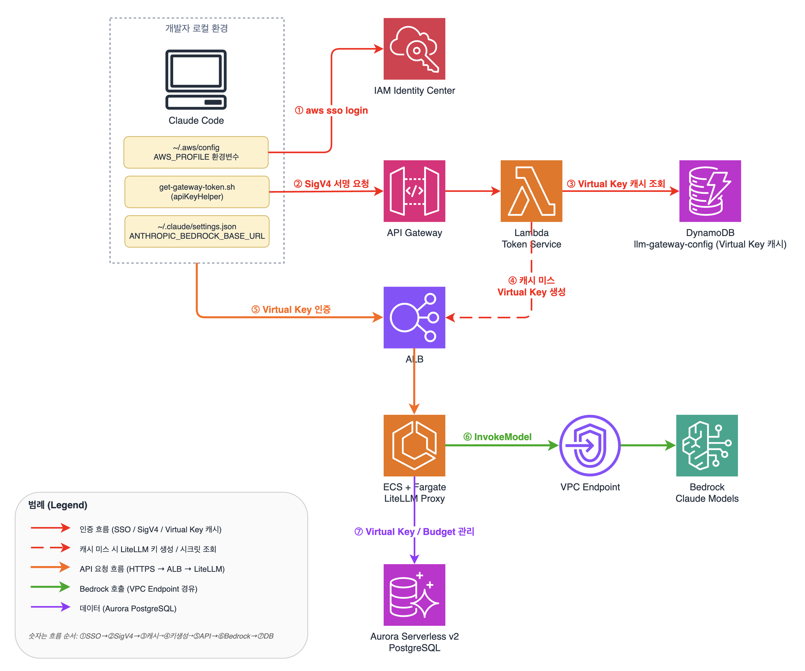
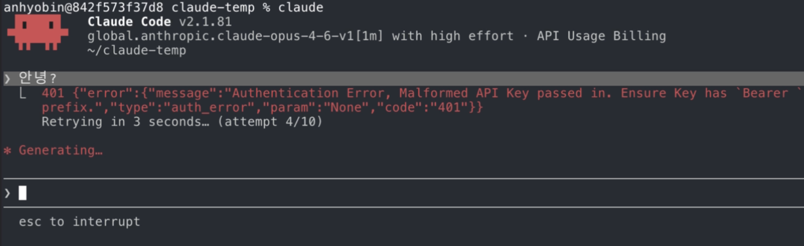
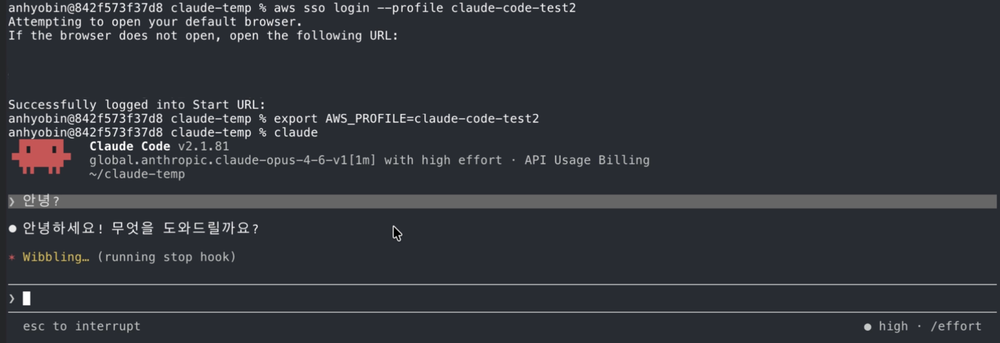
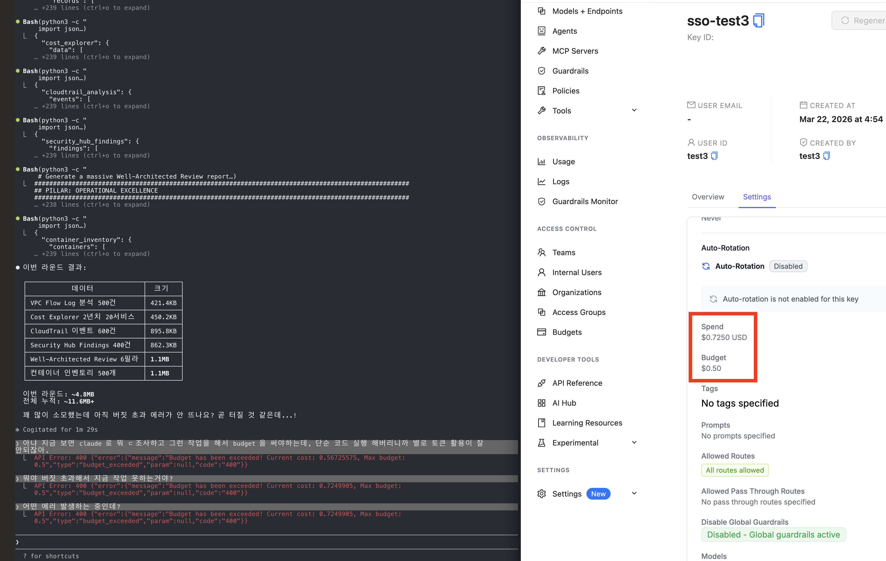

# Claude Code on Bedrock — Enterprise Blueprint

Claude Code on Amazon Bedrock을 엔터프라이즈 환경에서 안전하게 운영하기 위한 구현 가이드 및 샘플 코드입니다. SSO 인증, LLM Gateway, 사용자별 예산 관리, 사용량 모니터링까지 엔드투엔드 인프라를 CDK로 구현합니다.

LLM Gateway는 [Claude Code 공식 문서](https://code.claude.com/docs/en/llm-gateway)에서 소개하고 있는 **LiteLLM Proxy**를 기반으로 구현했습니다. LiteLLM의 Bedrock pass-through, Virtual Key 기반 사용자 관리, 예산 추적 기능을 활용하며, 오픈소스 범위에서 제공되지 않는 SSO 연동은 IAM Identity Center + 커스텀 Token Service로 구현했습니다.

개발자가 `aws sso login` 한번으로 인증하면, Token Service가 SSO 자격증명을 검증하고 LiteLLM Virtual Key를 자동 생성/반환합니다. Claude Code는 이 Virtual Key로 LLM Gateway를 통해 Amazon Bedrock의 Claude 모델을 호출합니다.

## 아키텍처



| # | 단계 | 설명 |
|---|------|------|
| 1 | SSO Login | 개발자가 `aws sso login`으로 IAM Identity Center 인증 |
| 2 | SigV4 서명 요청 | apiKeyHelper가 SSO 자격증명으로 Token Service(API Gateway) 호출 |
| 3 | Virtual Key 캐시 조회 | Token Service가 DynamoDB에서 사용자의 Virtual Key 조회 |
| 4 | Virtual Key 생성 | 캐시 미스 시 LiteLLM `/key/generate` API로 자동 생성 |
| 5 | Virtual Key 인증 | Claude Code가 Virtual Key로 ALB → LiteLLM Gateway 접근 |
| 6 | Bedrock InvokeModel | LiteLLM이 VPC Endpoint를 통해 Amazon Bedrock 호출 |
| 7 | Virtual Key/Budget 관리 | LiteLLM이 Aurora PostgreSQL에서 사용자별 사용량/예산 추적 |

## 인증 흐름 (상세)

```
개발자 터미널
  │
  ├─ aws sso login
  │   └─ 브라우저 → IAM Identity Center 로그인 (Username + Password)
  │   └─ SSO 세션 토큰 발급 → ~/.aws/sso/cache/ 저장
  │
  ├─ claude (Claude Code 실행)
  │   └─ apiKeyHelper (get-gateway-token.sh) 자동 호출
  │       │
  │       ├─ AWS_PROFILE에서 SSO 자격증명 export
  │       │
  │       ├─ Token Service 호출 (SigV4 서명)
  │       │   └─ API Gateway (IAM Auth) → Lambda
  │       │       ├─ requestContext.identity.userArn에서 username 추출
  │       │       ├─ DynamoDB 캐시 조회 (USER#{username}/VIRTUAL_KEY)
  │       │       │   ├─ 캐시 히트 → Virtual Key 즉시 반환
  │       │       │   └─ 캐시 미스 → LiteLLM /key/generate → DynamoDB 캐싱 → 반환
  │       │       └─ 응답: {"token": "sk-..."}
  │       │
  │       └─ Virtual Key를 stdout으로 반환
  │
  └─ Claude Code가 Virtual Key를 Bearer Token으로 사용
      └─ ALB (HTTPS) → ECS/LiteLLM → Bedrock (InvokeModel)
```

## 동작 확인

### SSO 인증 없이 접근 시


### SSO 인증 후 정상 동작


### 사용자별 예산 초과 시


## 기술 스택

| 카테고리 | 기술 | 설명 |
|----------|------|------|
| IaC | AWS CDK v2 (TypeScript) | NestedStack 구조, 단일 배포 |
| Gateway | LiteLLM Proxy (공식 이미지) | `ghcr.io/berriai/litellm:main-latest` |
| 컴퓨팅 | ECS Fargate (2 vCPU / 4 GB) | Private Subnet, ALB 연동 |
| 로드밸런서 | ALB (HTTPS) | 자체서명 인증서, TLS 1.3, idle timeout 300s |
| 인증 | IAM Identity Center + API Gateway IAM Auth | SSO -> SigV4 -> Virtual Key |
| Token Service | Lambda (Python 3.12) | 첫 로그인 시 Virtual Key 자동 생성, DynamoDB 캐싱 |
| DB (LiteLLM) | Aurora Serverless v2 (PostgreSQL 15.15) | 0.5~4 ACU, Isolated Subnet |
| DB (감사/설정) | DynamoDB (PAY_PER_REQUEST) | Audit 테이블 + Config 테이블 |
| 모니터링 | CloudWatch Dashboard + Alarms | ECS/ALB 메트릭, CPU/5xx 알람 |
| 네트워크 | VPC (2 AZ, NAT GW 1개) | Bedrock VPC Endpoint, S3/DynamoDB Gateway Endpoint |
| AI 모델 | Amazon Bedrock | Claude Opus 4.6, Sonnet 4.6, Haiku 4.5 |

## 디렉토리 구조

```
claude-code-on-bedrock-enterprise-blueprint/
├── bin/
│   └── app.ts                           # CDK 앱 진입점 (RootStack)
├── lib/
│   ├── config/
│   │   └── constants.ts                 # 프로젝트명, 모델 ID, 리전, 예산 기본값
│   └── stacks/
│       ├── root-stack.ts                # 루트 스택 (NestedStack 오케스트레이션)
│       ├── network-stack.ts             # VPC, SG, VPC Endpoints
│       ├── database-stack.ts            # Aurora Serverless v2
│       ├── auth-stack.ts                # Token Service (Lambda + API Gateway)
│       ├── gateway-stack.ts             # ALB + ECS Fargate + LiteLLM
│       └── monitoring-stack.ts          # DynamoDB (Audit/Config), CloudWatch
├── lambda/
│   └── token-service/
│       ├── handler.py                   # SSO ARN 파싱 -> Virtual Key 자동 생성/캐시 반환
│       ├── requirements.txt
│       └── tests/
│           └── test_handler.py
├── litellm/
│   ├── config.yaml                      # LiteLLM 설정 (참고용, 현재 기본 proxy 모드)
│   ├── Dockerfile                       # 커스텀 이미지 (향후 콜백 사용 시)
│   └── custom_callbacks/                # 감사 로그, CloudWatch 메트릭 콜백 (향후)
│       ├── __init__.py
│       ├── audit_logger.py
│       └── cloudwatch_metrics.py
├── scripts/
│   ├── get-gateway-token.sh             # apiKeyHelper - SSO -> Virtual Key 획득
│   └── setup-developer.sh               # 개발자 온보딩 안내 스크립트
├── templates/
│   ├── claude-settings.json             # Claude Code settings.json 템플릿
│   └── aws-config-template.ini          # AWS CLI SSO 프로필 템플릿
├── docs/
│   ├── high-level-architecture.png     # 아키텍처 다이어그램
│   ├── without_sso.png                 # SSO 미인증 시 에러 스크린샷
│   ├── with_sso.png                    # SSO 인증 후 정상 동작 스크린샷
│   ├── budget_error.png                # 예산 초과 에러 스크린샷
│   ├── deployment-guide.md             # 배포 가이드
│   ├── user-onboarding.md              # 사용자 온보딩 가이드
│   ├── operations-guide.md             # 운영 가이드
│   └── security.md                     # 보안 가이드
├── cdk.json
├── tsconfig.json
├── package.json
└── llm-gateway-guide.md                 # 전체 배포 가이드 (상세)
```

## CDK 스택 구조 (NestedStack)

```
LlmGatewayStack (Root)
├── Network    — VPC (2 AZ), Security Groups, VPC Endpoints (Bedrock, S3, DynamoDB)
├── Database   — Aurora Serverless v2 (PostgreSQL 15.15, 0.5~4 ACU)
│     └── depends on: Network
├── Auth       — Token Service Lambda + API Gateway (IAM Auth)
│     └── depends on: Network
├── Gateway    — ECS Fargate + ALB (HTTPS) + LiteLLM Proxy
│     └── depends on: Network, Database
└── Monitoring — DynamoDB (Audit/Config), CloudWatch Dashboard
      └── depends on: Gateway
```

## 사전 요구사항

| 도구 | 버전 | 용도 |
|------|------|------|
| AWS CLI | v2 | SSO 로그인, 자격증명 관리 |
| Node.js | 18+ | CDK 빌드, Claude Code 런타임 |
| AWS CDK | v2 | 인프라 배포 |
| Python | 3.12+ | Lambda 로컬 테스트 (선택) |

AWS 계정 사전 요구사항:
- AWS Organization + IAM Identity Center 활성화
- Amazon Bedrock Claude 모델 사용 승인 (Opus 4.6, Sonnet 4.6, Haiku 4.5)
- ACM 인증서 (ALB HTTPS용) 또는 자체서명 인증서

## 배포

```bash
# 의존성 설치
npm install

# CDK Bootstrap (최초 1회)
cdk bootstrap

# 배포 (ACM 인증서 ARN 필수)
cdk deploy LlmGatewayStack -c certificateArn=arn:aws:acm:us-east-1:123456789012:certificate/xxxxxxxx
```

NestedStack 구조이므로 루트 스택 하나만 배포하면 모든 하위 스택(Network, Database, Auth, Gateway, Monitoring)이 함께 배포됩니다.

## 엔드포인트

배포 완료 후 다음 엔드포인트가 생성됩니다:

| 엔드포인트 경로 | 설명 |
|----------------|------|
| `https://{ALB_DNS}/bedrock/*` | LiteLLM Bedrock pass-through (Claude Code 요청) |
| `https://{ALB_DNS}/health/liveliness` | LiteLLM 헬스체크 |
| `https://{ALB_DNS}/ui/` | LiteLLM Admin UI (Virtual Key 관리) |
| `https://{API_GW_ID}.execute-api.{REGION}.amazonaws.com/v1/auth/token` | Token Service |
| `https://{IDC_ID}.awsapps.com/start` | AWS Access Portal (SSO 로그인) |

## 사용자 온보딩

### 관리자 작업

1. **IAM Identity Center에서 사용자 생성** 및 그룹 할당

> Virtual Key는 개발자가 첫 SSO 로그인 시 Token Service에 의해 자동 생성됩니다. 관리자가 LiteLLM UI에서 키를 발급하거나 DynamoDB에 수동 등록할 필요가 없습니다.

### 개발자 작업

1. **AWS CLI SSO 프로필 설정** (`~/.aws/config`)

   프로덕션 환경에서는 모든 개발자가 동일한 프로필(`claude-code`)을 사용합니다. 사용자 구분은 프로필이 아닌 브라우저에서의 SSO 로그인 시 각자의 계정으로 수행합니다.

   ```ini
   [profile claude-code]
   sso_session = my-sso
   sso_account_id = {ACCOUNT_ID}
   sso_role_name = ClaudeCodeUser
   region = us-east-1
   output = json

   [sso-session my-sso]
   sso_start_url = https://{IDC_ID}.awsapps.com/start
   sso_region = us-east-1
   sso_registration_scopes = sso:account:access
   ```

2. **SSO 로그인**
   ```bash
   export AWS_PROFILE=claude-code
   aws sso login
   ```
   브라우저가 열리면 각자의 IAM Identity Center 계정(사용자명/비밀번호)으로 로그인합니다.

3. **Claude Code settings.json 설정** (`~/.claude/settings.json`)
   ```json
   {
     "env": {
       "CLAUDE_CODE_USE_BEDROCK": "1",
       "ANTHROPIC_BEDROCK_BASE_URL": "https://{ALB_DNS}/bedrock",
       "CLAUDE_CODE_SKIP_BEDROCK_AUTH": "1",
       "AWS_REGION": "us-east-1",
       "AWS_PROFILE": "claude-code",
       "ANTHROPIC_DEFAULT_OPUS_MODEL": "us.anthropic.claude-opus-4-6-v1",
       "ANTHROPIC_DEFAULT_SONNET_MODEL": "us.anthropic.claude-sonnet-4-6",
       "ANTHROPIC_DEFAULT_HAIKU_MODEL": "us.anthropic.claude-haiku-4-5-20251001-v1:0",
       "CLAUDE_CODE_DISABLE_EXPERIMENTAL_BETAS": "1"
     },
     "apiKeyHelper": "path/to/scripts/get-gateway-token.sh"
   }
   ```

   > 자체서명 인증서 사용 시 `NODE_EXTRA_CA_CERTS` 환경변수로 인증서 경로를 지정해야 합니다.

4. **Claude Code 실행**
   ```bash
   claude
   ```

### apiKeyHelper 동작 방식

`get-gateway-token.sh`는 `AWS_PROFILE` 환경변수를 기반으로 SSO 자격증명을 가져옵니다.

- **프로덕션**: 모든 개발자가 `AWS_PROFILE=claude-code`를 사용합니다. 프로필은 SSO 인스턴스(시작 URL, 계정, 역할)를 찾는 키일 뿐이며, 실제 사용자 구분은 `aws sso login` 시 브라우저에서 로그인하는 계정에 의해 결정됩니다.
- **테스트 환경**: 여러 사용자를 시뮬레이션할 때는 `AWS_PROFILE` 환경변수를 전환합니다.
  ```bash
  # 기본 사용자
  export AWS_PROFILE=claude-code
  aws sso login

  # 다른 사용자로 전환 (테스트용)
  export AWS_PROFILE=claude-code-test1
  aws sso login
  ```

## 환경변수 (Claude Code 설정)

| 변수 | 값 | 설명 |
|------|-----|------|
| `CLAUDE_CODE_USE_BEDROCK` | `1` | Bedrock 통합 활성화 |
| `ANTHROPIC_BEDROCK_BASE_URL` | `https://{ALB_DOMAIN}/bedrock` | Gateway Bedrock pass-through URL |
| `CLAUDE_CODE_SKIP_BEDROCK_AUTH` | `1` | SigV4 인증 생략 (Gateway가 처리) |
| `AWS_REGION` | `us-east-1` | AWS 리전 |
| `AWS_PROFILE` | `claude-code` | SSO 프로필 (apiKeyHelper가 참조) |
| `ANTHROPIC_DEFAULT_OPUS_MODEL` | `us.anthropic.claude-opus-4-6-v1` | Opus 모델 고정 |
| `ANTHROPIC_DEFAULT_SONNET_MODEL` | `us.anthropic.claude-sonnet-4-6` | Sonnet 모델 고정 |
| `ANTHROPIC_DEFAULT_HAIKU_MODEL` | `us.anthropic.claude-haiku-4-5-20251001-v1:0` | Haiku 모델 고정 |

## 관련 문서

| 문서 | 설명 |
|------|------|
| [Claude Code - LLM Gateway](https://code.claude.com/docs/en/llm-gateway) | Claude Code LLM Gateway 공식 문서 (LiteLLM 포함) |
| [Claude Code on Amazon Bedrock](https://code.claude.com/docs/en/amazon-bedrock) | Claude Code on Bedrock 공식 문서 |
| [Guidance for Claude Code with Amazon Bedrock](https://aws.amazon.com/solutions/guidance/claude-code-with-amazon-bedrock/) | AWS Solutions Library 가이던스 |
| [LiteLLM - Bedrock Pass-through](https://docs.litellm.ai/docs/pass_through/bedrock) | LiteLLM Bedrock pass-through 문서 |
