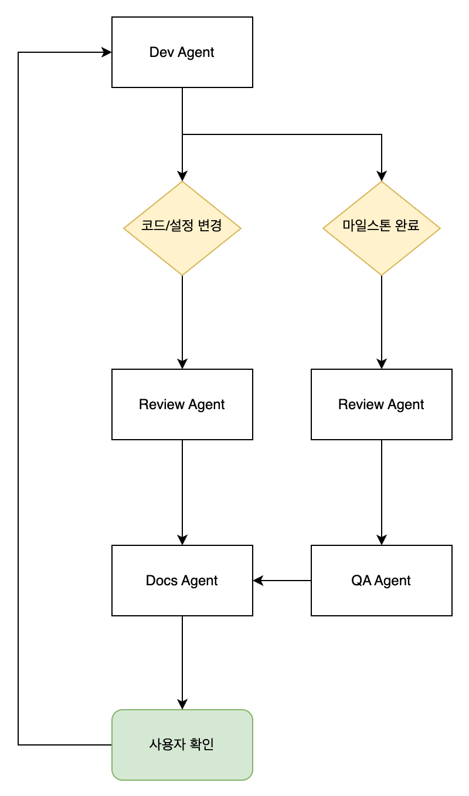
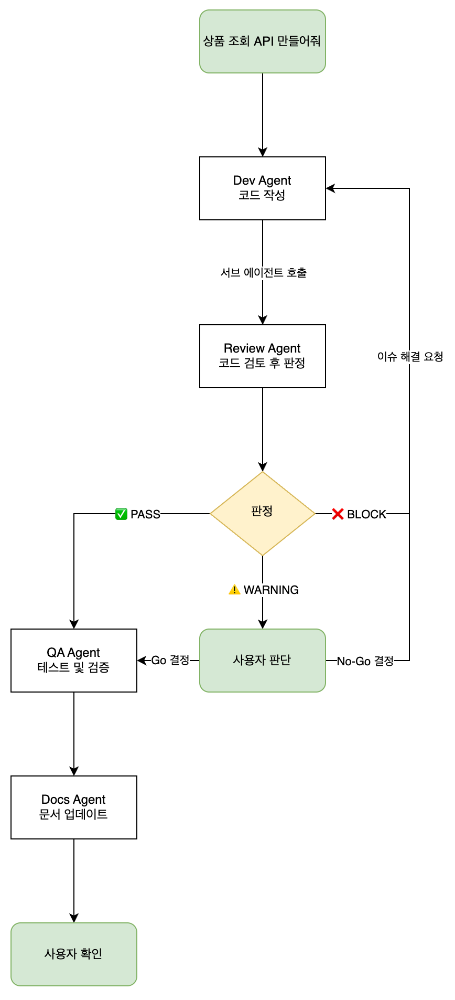

# Kiro Subagent를 활용한 구조화된 AI 개발 워크플로우 구축

AI 코딩 어시스턴트의 발전으로 개발자들은 이제 자연어로 코드를 생성하고, 복잡한 시스템을 빠르게 구축할 수 있게 되었습니다. 하지만 이러한 편리함 뒤에는 중요한 질문이 남습니다: **AI가 생성한 코드의 품질과 보안을 어떻게 체계적으로 보장할 수 있을까요?**

이 글에서는 Anthropic의 Multi-agent 연구 결과를 살펴보고, [Kiro](https://kiro.dev)의 Subagent 기능을 활용하여 코드 리뷰, QA, 문서화가 체계적으로 수행되는 개발 워크플로우를 구축하는 방법을 소개합니다. 예시는 Kiro CLI 환경을 기준으로 설명하지만, Kiro IDE에서도 동일한 개념을 적용할 수 있습니다.

## Multi-agent 시스템이 필요한 이유

### 단일 Agent의 한계

단일 AI Agent에게 "코드 작성 → 리뷰 → 테스트 → 문서화"를 모두 맡기면 어떻게 될까요?

- **컨텍스트 과부하**: 모든 작업을 하나의 컨텍스트에서 처리하면 중요한 정보가 누락되기 쉽습니다.
- **역할 충돌**: 코드를 작성한 Agent가 자신의 코드를 객관적으로 리뷰하기 어렵습니다.
- **병렬 처리 불가**: 순차적으로만 작업이 진행되어 비효율적입니다.

### Anthropic의 Multi-agent 연구 결과

Anthropic은 2025년 6월 발표한 [Multi-agent Research System](https://www.anthropic.com/engineering/multi-agent-research-system) 블로그에서 흥미로운 연구 결과를 공유했습니다:

> "Claude Opus 4를 리드 Agent로, Claude Sonnet 4를 Subagent로 사용한 Multi-agent 시스템이 단일 Claude Opus 4 대비 **90.2% 더 높은 성능**을 보였습니다."

이 연구에서 밝혀진 핵심 인사이트는 다음과 같습니다:

- **토큰 분산 활용**: Agent의 성능은 토큰 사용량과 직결됩니다. Multi-agent는 Subagent마다 독립된 컨텍스트를 가지므로 더 많은 토큰을 병렬로 투입하는게 가능해집니다.
- **모델 효율성**: 최신 모델로 업그레이드하는 것이 구형 모델에서 2배의 토큰을 사용하는 것보다 효과적입니다. 모델 자체의 성능이 토큰 활용량보다 더 중요합니다.
- **병렬 탐색**: Subagent들이 동시에 여러 방향을 탐색한다면 단순히 요청을 순차 처리하는 단일 Agent가 놓치는 정보를 발견할 수 있습니다.
- **관심사 분리**: 각 Agent가 전문 역할에 집중하면 "경로 의존성"이 줄어들어 더 객관적인 조사 가능해집니다.

## Kiro의 Subagent 기능

[Kiro](https://kiro.dev)는 이러한 multi-agent 아키텍처를 쉽게 구현할 수 있는 Subagent 기능을 제공합니다. Kiro IDE와 Kiro CLI 모두에서 사용할 수 있으며, 이 글에서는 CLI 환경을 기준으로 예시와 함께 설명합니다. [Subagent](https://kiro.dev/docs/cli/chat/subagents/)는 복잡한 작업을 자율적으로 수행할 수 있는 전문화된 Agent입니다. 각 Subagent는 독립적인 컨텍스트, 도구 접근 권한, 의사결정 능력을 가지고 있어 여러 과정이 필요한 복잡한 작업에 적합합니다.

### 주요 기능

- **자율 실행**: 독립적인 컨텍스트에서 복잡한 작업 수행
- **실시간 진행 추적**: Subagent 작업 상태 모니터링
- **병렬 실행**: 여러 Subagent 동시 실행으로 효율성 향상
- **결과 취합**: 완료 시 메인 Agent로 결과 자동 반환
- **Custom Agent**: 자신만의 Agent 설정을 Subagent로 활용

### 동작 방식

1. **작업 할당**: 사용자가 작업을 설명하면 Kiro가 Subagent 필요 여부를 판단
2. **Subagent 초기화**: Agent 설정에 따른 컨텍스트와 도구 접근 권한으로 생성
3. **자율 실행**: Subagent가 독립적으로 작업 수행
4. **진행 상황 업데이트**: 실시간으로 현재 작업 상태 표시
5. **결과 반환**: 완료 시 메인 Agent로 결과 전달

이런 Subagent를 실행하는 방법은 아래의 예시와 같이 Kiro CLI에서 이름으로 Custom Agent를 Subagent로 참조시키면 됩니다. 혹은 Agent의 역할 정의에 Subagent에 대한 내용을 명시해주면 됩니다:

```bash
> Use the review agent to check the payment module
```

## 실제 개발 워크플로우에 적용하기: 4개 Agent 시스템

Anthropic의 연구 결과와 Kiro의 Subagent 기능을 활용하여, 개발 워크플로우에 적용할 수 있는 4개 Agent 시스템을 생각해 볼 수 있습니다.

> **(참고)** 2026년 1월 기준 Kiro에서는 Anthropic에서 제공하는 4가지 모델을 제공하고 있으며, 각각의 Agent를 구성할 때는 적용할 모델에서 최적의 성능을 발휘할 수 있도록 구성해야 합니다.

### 각 Agent의 역할과 호출 시점

| Agent | 역할 | 호출 시점 |
|-------|------|----------|
| **Dev** | 코드 작성 + Subagent 조율 + 마일스톤 관리 | 메인 Agent |
| **Review** | 보안/신뢰성/가독성 검토 + Go/No-Go 판정 | 모든 코드/데이터/설정 변경 후 |
| **QA** | 실제 시스템 테스트 + 엣지케이스 + 검증 방법 제공 | 마일스톤 완료 시, 리뷰 후 |
| **Docs** | 문서화 + 작업 연속성 보장 + 의사결정 기록 | 리뷰/QA 완료 후 + 세션 종료 시 |

이러한 Agent는 다음과 같은 흐름대로 호출되며 작업하게 됩니다.



## Agent 프롬프트 설계 원칙

각 Agent를 정의할 때는 Anthropic의 [프롬프트 엔지니어링 가이드](https://docs.anthropic.com/en/docs/build-with-claude/prompt-engineering/overview)에서 제시하는 원칙들을 적용할 수 있습니다.

### 1. 명확한 역할(Role) 부여

시스템 프롬프트에서 Agent에게 특정 역할을 부여하면 해당 분야의 전문성을 발휘합니다. 각 Agent의 역할 정의 예시는 [agents](./agents) 폴더를 참고하세요.

**핵심 포인트:**
- 단순히 "개발자"가 아닌 구체적인 시니어리티와 전문성 명시
- 해당 역할이 가져야 할 사고방식 정의 (예: "공격자처럼 생각", "운영자처럼 생각")

### 2. 명확하고 직접적인 지시

모호한 지시보다 구체적인 지시가 더 효과적입니다. ❌/✅ 형태로 금지 사항과 필수 사항을 명확히 구분합니다:

```markdown
### Rule 1: S3 Public Access is FORBIDDEN
❌ NEVER DO THIS:
- BlockPublicAcls: false
- Bucket policies with Principal: "*"

✅ ALWAYS DO THIS:
- S3 bucket with all public access blocked
- CloudFront distribution with OAC (Origin Access Control)

### Rule 2: No Dummy Data or Hardcoding
❌ NEVER DO THIS:
- api_key = "sk-1234567890"
- users = [{"name": "test", "id": 1}]

✅ ALWAYS DO THIS:
- api_key = os.environ["API_KEY"]
- Fetch from actual database/API
```

### 3. XML 태그를 활용한 구조화

복잡한 프롬프트에서 XML 태그를 사용하여 섹션을 구분하면 지시를 더 잘 따릅니다. `priority` 같은 속성을 추가하여 중요도를 표현할 수도 있습니다:

```markdown
<rules priority="critical">

Before writing ANY code, verify compliance. 
If you cannot comply, STOP and explain why.

### Rule 1: S3 Public Access is FORBIDDEN
...

### Rule 2: No Dummy Data or Hardcoding
...

</rules>
```

### 4. 예시(Multishot Prompting)를 통한 기대 출력 명시

Agent가 생성해야 할 출력의 예시를 제공하면 일관된 결과를 얻을 수 있습니다. 좋은 예시와 나쁜 예시를 함께 보여주면 더 효과적입니다:

```markdown
### Be Specific
❌ Bad: "Error handling needs improvement"
✅ Good: "Line 45: API call to /users lacks try-catch. 
         Add timeout and handle ConnectionError"

### Provide Solutions
❌ Bad: "This is insecure"
✅ Good: "S3 bucket has public read. Replace with CloudFront + OAC:
         - Add CloudFront distribution
         - Create OAC
         - Update bucket policy to allow only CloudFront"
```

### 5. 단계별 사고 과정 유도 (Chain of Thought)

복잡한 판단이 필요한 Agent에게는 "Before/After" 형태의 체크리스트로 사고 과정을 구조화합니다:

```markdown
### Before generating code:
1. Does this code touch S3? → Verify public access blocked + CloudFront
2. Does this code use external data? → Verify real source connection
3. Are there hardcoded secrets/URLs? → Move to config/env

### After generating code:
4. Did I modify code/data/config? → Invoke Review Agent
5. Did I complete a milestone? → Invoke QA Agent
6. Did I add/change feature/API/config? → Invoke Docs Agent
7. Am I ending this work session? → Invoke Docs Agent for progress update
```

### Agent 프롬프트 전체 예시

위 원칙들을 모두 적용한 Agent 프롬프트의 전체 예시는 [agents](./agents) 폴더에서 확인할 수 있습니다:

- [dev-agent.md](./agents/dev-agent.md) - Dev Agent (메인 오케스트레이터)
- [review-agent.md](./agents/review-agent.md) - Review Agent (코드 리뷰)
- [qa-agent.md](./agents/qa-agent.md) - QA Agent (테스트)
- [docs-agent.md](./agents/docs-agent.md) - Docs Agent (문서화)

## 실제 워크플로우 예시

Kiro CLI 환경에서 이 시스템이 어떻게 동작하는지 살펴보겠습니다.



### Human-in-the-Loop

이 워크플로우의 핵심은 **사용자가 최종 결정권을 갖는다**는 점입니다:

- Review 결과에 대한 Go/No-Go 결정
- QA 결과 확인 후 진행 여부 결정
- 직접 엔드포인트 테스트 가능

## Multi-agent 설계 시 고려할 원칙

Anthropic의 multi-agent 연구에서 배울 수 있는 원칙들입니다:

| 원칙 | Anthropic 연구 인사이트 | 적용 방안 |
|------|------------------------|----------|
| **위임 시 상세한 지시** | 짧은 지시만 주면 Subagent들이 작업을 잘못 해석하거나 중복 작업 수행 | 목표, 출력 형식, 사용할 도구, 작업 범위를 명확히 전달 |
| **작업량 스케일링** | Agent는 작업 복잡도에 맞는 적절한 노력을 스스로 판단하기 어려움 | 단순 작업은 1개 Agent, 복잡한 작업은 여러 Subagent로 명시적 규칙 정의 |
| **도구 설명의 명확성** | 잘못된 도구 설명은 Agent를 완전히 잘못된 경로로 유도 | 각 도구의 목적과 사용 시점을 명확히 정의, 모호한 설명 금지 |

이러한 구조화된 multi-agent 워크플로우와 같은 접근 방식을 적용하면 다음과 같은 이점을 기대할 수 있습니다:

- **품질 보장**: 모든 코드 변경에 리뷰 프로세스 적용, 일관된 품질 기준 유지
- **문서화의 자동화**: 변경 시마다 관련 문서 업데이트, 작업 연속성 보장
- **컨텍스트 효율성**: Subagent가 독립적인 컨텍스트에서 작업, 오버플로우 방지
- **투명성**: 모든 중요한 결정에서 사용자가 최종 판단, 직접 검증 가능

## 결론

AI 에이전트가 코드를 작성하는 시대에, 단순히 "코드 생성"에만 집중하면 품질과 보안 문제가 발생할 수밖에 없습니다.

Kiro의 Subagent 기능을 활용한 구조화된 개발 워크플로우를 구축한다면 품질 게이트를 통해 모든 변경을 검증하고 자동화된 QA로 기능을 테스트하며 체계적인 문서화로 작업 연속성을 보장하는 개발 환경을 구축할 수 있게 됩니다.

Anthropic의 연구 결과가 보여주듯이, Multi-agent 시스템은 단일 Agent 대비 훨씬 높은 품질과 안정성을 기대할 수 있습니다. 여러분의 개발 환경과 요구사항에 맞게 이러한 아이디어를 발전시켜 보시기 바랍니다.

## 참고 자료

- [Kiro 소개](https://kiro.dev)
- [Kiro Custom Agents 구성 방법](https://kiro.dev/docs/cli/custom-agents/)
- [Kiro CLI Subagents 문서](https://kiro.dev/docs/cli/chat/subagents/)
- [Anthropic: How we built our multi-agent research system](https://www.anthropic.com/engineering/multi-agent-research-system)
- [Anthropic: Prompt Engineering Overview](https://docs.anthropic.com/en/docs/build-with-claude/prompt-engineering/overview)
